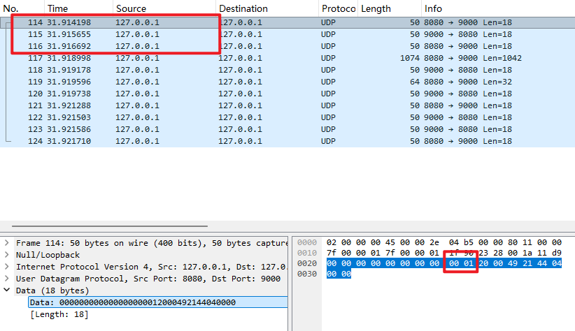
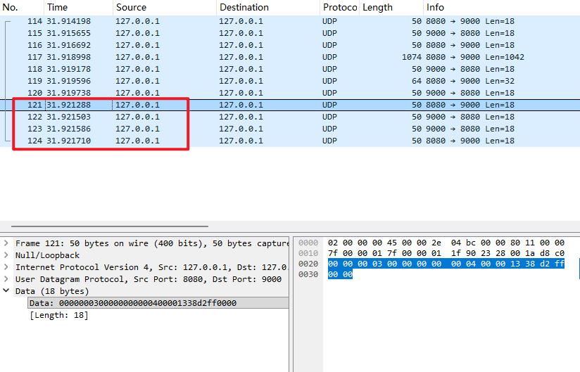
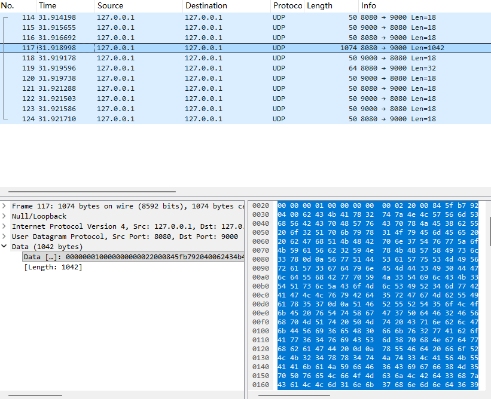
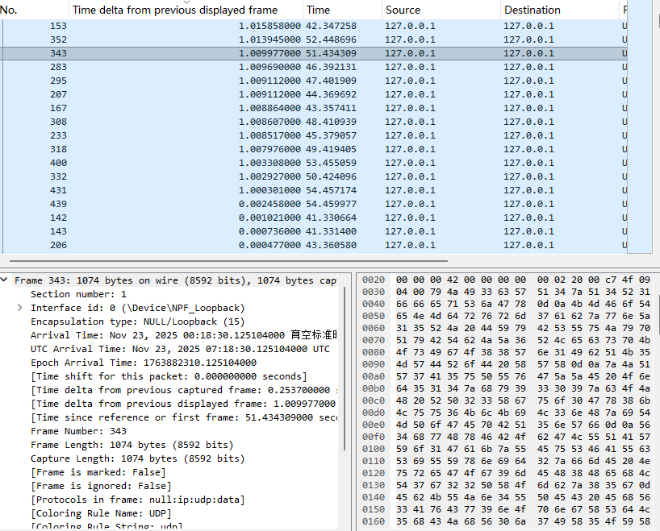
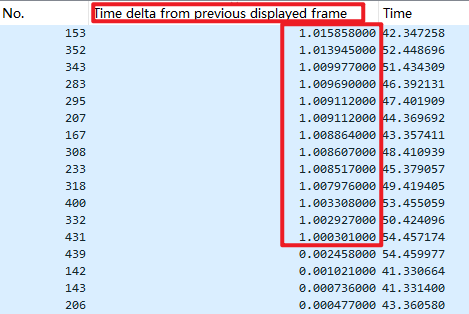
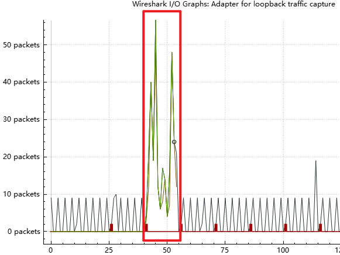
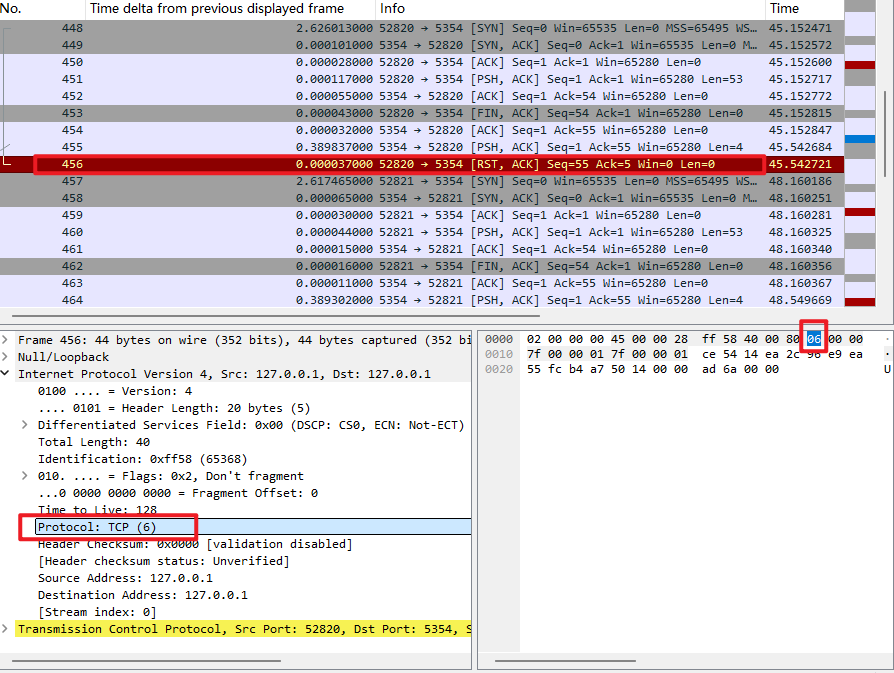

# Pipelined Reliable Transfer Protocol Implementation and Analysis

**Course:** CMPT 371 - Data Communications and Networking  
**Project:** Mini-Project 2 - Custom Reliable Transport Protocol  
**Date:** November 23, 2025

---

## Executive Summary

This report presents the design, implementation, and analysis of a custom connection-oriented, reliable, pipelined transport protocol built on top of UDP. Our protocol implements key features found in TCP, including three-way handshake connection establishment, sliding window flow control, congestion control with AIMD (Additive Increase Multiplicative Decrease) algorithm, timeout-based retransmission, and MD5 checksum-based error detection. Through comprehensive testing under various network conditions including packet loss rates up to 25% and data corruption rates of 15%, we demonstrate that our protocol maintains 100% data integrity while adapting its transmission rate to network conditions. The protocol achieves throughput ranging from 3.72 KB/s under severe packet loss to 8789.76 KB/s under ideal conditions with pipelined transmission.

---

## 1. Protocol Specification

### 1.1 Design Overview

Our protocol, which we call PRTP (Pipelined Reliable Transfer Protocol), is designed as a transport layer protocol that provides reliable, in-order delivery of data over an unreliable UDP channel. The protocol addresses the fundamental challenge posed in the assignment: how to test reliability mechanisms when running locally without natural network impairments. We solved this by implementing a socket wrapper layer that simulates packet loss, bit corruption, and network delay at the application level, allowing controlled testing of our reliability mechanisms.

The protocol architecture consists of several key components working together. At the lowest level, we use UDP sockets (SOCK_DGRAM) to provide an unreliable datagram service. On top of this, we built a socket wrapper that intercepts all send and receive operations to simulate network impairments. The reliability layer implements the sliding window protocol with timeout-based retransmission, while the congestion control layer dynamically adjusts the window size based on network feedback. Finally, the segment layer defines our packet format and implements checksum verification.

### 1.2 Segment Format

Our protocol uses a fixed 18-byte header followed by variable-length payload data. The segment structure is designed to be compact while providing all necessary fields for reliable, ordered delivery with flow and congestion control.

```
 0                   1                   2                   3
 0 1 2 3 4 5 6 7 8 9 0 1 2 3 4 5 6 7 8 9 0 1 2 3 4 5 6 7 8 9 0 1
+-+-+-+-+-+-+-+-+-+-+-+-+-+-+-+-+-+-+-+-+-+-+-+-+-+-+-+-+-+-+-+-+
|                        Sequence Number                        |
+-+-+-+-+-+-+-+-+-+-+-+-+-+-+-+-+-+-+-+-+-+-+-+-+-+-+-+-+-+-+-+-+
|                     Acknowledgment Number                     |
+-+-+-+-+-+-+-+-+-+-+-+-+-+-+-+-+-+-+-+-+-+-+-+-+-+-+-+-+-+-+-+-+
|     Flags     |  Window Size  |           Checksum            |
+-+-+-+-+-+-+-+-+-+-+-+-+-+-+-+-+-+-+-+-+-+-+-+-+-+-+-+-+-+-+-+-+
|  Payload Len  |                                               |
+-+-+-+-+-+-+-+-+                                               +
|                                                               |
+                         Payload Data                          +
|                                                               |
+-+-+-+-+-+-+-+-+-+-+-+-+-+-+-+-+-+-+-+-+-+-+-+-+-+-+-+-+-+-+-+-+
```

**Field Descriptions:**

- **Sequence Number (4 bytes):** Packet-level sequence number starting from 0. Unlike TCP which uses byte-level sequence numbers, we increment by 1 for each packet sent. This simplifies our implementation while maintaining the ability to detect duplicates and ensure in-order delivery.

- **Acknowledgment Number (4 bytes):** Cumulative acknowledgment indicating the next expected sequence number. When the receiver sends ACK=N, it confirms receipt of all packets up to N-1.

- **Flags (2 bytes):** Control flags for connection management and special packet types. We implement SYN (0x01) for connection initiation, ACK (0x02) for acknowledgments, FIN (0x04) for connection termination, and RST (0x08) for connection reset, though RST is defined but not actively used in our current implementation.

- **Window Size (2 bytes):** Advertised receive window size for flow control. The receiver uses this field to inform the sender how many packets it can accept, preventing buffer overflow.

- **Checksum (4 bytes):** MD5-based integrity check computed over the header fields and payload. We use the first 4 bytes of the MD5 hash for efficient verification while maintaining strong error detection capabilities.

- **Payload Length (2 bytes):** Length of the payload data in bytes, with a maximum of 1024 bytes per segment.

- **Payload Data (variable):** Application data being transmitted, up to 1024 bytes per segment.

### 1.3 Connection Establishment: Three-Way Handshake

Our protocol establishes connections using a three-way handshake mechanism similar to TCP. This ensures both endpoints are ready to communicate and synchronizes initial sequence numbers before data transfer begins.


*Figure 1: Three-way handshake captured in Wireshark showing SYN, SYN-ACK, and ACK packets*

The handshake proceeds as follows. First, the client sends a SYN packet with its initial sequence number (typically 0) to the server. The server responds with a SYN-ACK packet, acknowledging the client's SYN and sending its own initial sequence number. Finally, the client sends an ACK packet to acknowledge the server's SYN, completing the handshake. At this point, both sides transition to the ESTABLISHED state and data transfer can begin.

A critical design decision we made was to disable packet loss simulation during the handshake phase. We implemented a handshake_mode flag in our socket wrapper that prevents packet drops during connection establishment and termination. This ensures reliable connection setup even in high-loss environments, as connection establishment should not be subject to the same unreliability as data transfer. Once the handshake completes, we enable loss simulation by calling enable_loss_simulation(), allowing us to test our reliability mechanisms during data transfer.

### 1.4 Connection Termination: Four-Way Handshake

Connection termination follows a four-way handshake pattern, allowing both sides to gracefully close the connection and ensure all data has been received.


*Figure 2: Four-way handshake showing graceful connection termination*

The termination sequence begins when the sender finishes transmitting all data and sends a FIN packet. The receiver acknowledges this FIN with an ACK, then sends its own FIN packet to indicate it has no more data to send. Finally, the sender acknowledges the receiver's FIN with a final ACK, and both sides close the connection. Similar to connection establishment, we disable packet loss simulation during the four-way handshake to ensure clean connection termination.

### 1.5 Reliability Mechanism

Our reliability mechanism is built on a Go-Back-N sliding window protocol with timeout-based retransmission. The sender maintains a window of unacknowledged packets and uses a 1-second timeout interval to detect packet loss.

The core of our reliability implementation resides in the ReliabilityLayer class. We maintain two key pointers: send_base, which tracks the oldest unacknowledged packet, and next_seq_num, which indicates the next sequence number to be assigned. The difference between these two values represents the number of packets currently in flight, which must not exceed the window size.

```python
class ReliabilityLayer:
    def __init__(self, window_size: int = 1, timeout_interval: float = 1.0):
        self.window_size = window_size
        self.timeout_interval = timeout_interval
        self.send_base = 0
        self.next_seq_num = 0
        self.buffer: Dict[int, Segment] = {}
        self.timers: Dict[int, float] = {}
```

When sending a packet, we first check if the window allows transmission by verifying that next_seq_num - send_base is less than window_size. If space is available, we assign the sequence number, send the packet, buffer it for potential retransmission, and start a timer. The buffer stores the complete segment so we can retransmit it if needed, while the timer records when the packet was sent.

```python
def send_segment(self, segment: Segment, sock_wrapper: SocketWrapper) -> bool:
    if not self.can_send():
        return False

    segment.seq_num = self.next_seq_num
    sock_wrapper.send_segment(segment.serialize())

    self.buffer[self.next_seq_num] = segment
    self.timers[self.next_seq_num] = time.time()

    self.next_seq_num += 1
    return True
```

When an ACK arrives, we process it as a cumulative acknowledgment. If the ACK number is greater than our current send_base, we remove all acknowledged packets from the buffer and timer dictionary, then advance send_base to the ACK number. This cumulative ACK scheme reduces the number of acknowledgments needed and simplifies the protocol.

The timeout mechanism runs continuously during transmission. We check each unacknowledged packet's timer, and if more than 1 second has elapsed since it was sent, we retransmit all packets from send_base onwards. This Go-Back-N approach is simpler than selective repeat but may retransmit packets that were successfully received, which is acceptable for our purposes.

On the receiver side, we implement strict in-order delivery. We maintain an expected_data_seq counter that starts at 1 (after the handshake). When a data packet arrives, we check its sequence number. If it matches expected_data_seq, we accept the packet, append its payload to our received data buffer, increment expected_data_seq, and send an ACK for the next expected packet. If the sequence number is less than expected, it is a duplicate packet, so we send a duplicate ACK but do not add the data again. If the sequence number is greater than expected, it is an out-of-order packet, which we discard and respond with an ACK for the packet we are still expecting. This forces the sender to retransmit from the gap, implementing the Go-Back-N protocol.

### 1.6 Flow Control Mechanism

Flow control prevents the sender from overwhelming the receiver with data. We implement this through a sliding window mechanism where the receiver advertises its available buffer space in the window_size field of each ACK packet. The sender respects this advertised window and never sends more packets than the receiver can handle.

In our implementation, the receiver advertises a fixed window size of 8192 bytes in each segment. While we do not implement dynamic receiver window adjustment based on actual buffer occupancy, the sender's transmission is still controlled by the congestion window, which provides effective flow control. The sender's effective window is the minimum of the congestion window and the advertised receiver window, though in our tests the congestion window is typically the limiting factor.

### 1.7 Congestion Control Mechanism

Our congestion control implementation follows TCP's AIMD (Additive Increase Multiplicative Decrease) algorithm with three states: slow start, congestion avoidance, and fast recovery. The congestion window (cwnd) determines how many packets can be in flight at any time, and it adjusts dynamically based on network feedback.

```python
class CongestionControl:
    def __init__(self, initial_cwnd: float = 1.0, initial_ssthresh: float = 64.0):
        self.cwnd = initial_cwnd
        self.ssthresh = initial_ssthresh
        self.state = CongestionState.SLOW_START
        self.dup_ack_count = 0
        self.last_ack_num = -1
```

The protocol begins in slow start with cwnd set to 1. For each new ACK received, we increase cwnd by 1, resulting in exponential growth. This allows the protocol to quickly probe for available bandwidth. When cwnd reaches the slow start threshold (ssthresh), we transition to congestion avoidance mode where cwnd increases by 1/cwnd for each ACK, resulting in linear growth. This more conservative approach prevents overshooting the network's capacity.

When packet loss is detected through timeout, we interpret this as a congestion signal. We set ssthresh to half the current cwnd (with a minimum of 2), reset cwnd to 1, and return to slow start. This multiplicative decrease quickly reduces the sending rate to alleviate congestion. The protocol then gradually increases the window again, implementing the AIMD algorithm that ensures fairness and stability.

We also implement fast retransmit and fast recovery for more efficient loss recovery. When three duplicate ACKs are received, indicating a specific packet was lost but subsequent packets arrived successfully, we immediately retransmit the missing packet without waiting for timeout. We then set ssthresh to cwnd/2, set cwnd to ssthresh + 3, and enter fast recovery mode. In fast recovery, we increase cwnd by 1 for each additional duplicate ACK, allowing new packets to be sent while waiting for the retransmitted packet to be acknowledged. When a new ACK arrives, we exit fast recovery and set cwnd to ssthresh, entering congestion avoidance.

### 1.8 Error Detection Mechanism

We implement error detection using MD5 checksums computed over the entire segment including header and payload. When a segment is serialized for transmission, we calculate the MD5 hash of the sequence number, acknowledgment number, flags, window size, and payload data. We then extract the first 4 bytes of the hash as our checksum value.

```python
def calculate_checksum(self) -> int:
    data = struct.pack('!IIHH',
                      self.seq_num,
                      self.ack_num,
                      self.flags,
                      self.window_size)
    data += self.payload

    md5_hash = hashlib.md5(data).digest()
    return struct.unpack('!I', md5_hash[:4])[0]
```

When a segment is received, we verify the checksum before processing it. If the stored checksum does not match the calculated checksum, we return None from the deserialize method, effectively discarding the corrupted packet. The sender will eventually timeout and retransmit the packet, ensuring data integrity.

This checksum mechanism proved highly effective in our testing. Even when we simulated 15% bit corruption at random positions in the packet (including IP and UDP headers), our protocol successfully detected all corrupted packets and maintained 100% data integrity through retransmission.

### 1.9 Network Simulation Layer

A key challenge in this project was testing reliability mechanisms in a local environment where packets do not naturally experience loss or corruption. We solved this by implementing a socket wrapper that intercepts all send and receive operations and simulates network impairments.

```python
class SocketWrapper:
    def __init__(self, local_addr, remote_addr,
                 loss_rate=0.0, corruption_rate=0.0, delay_range=(0.0, 0.0)):
        self.sock = socket.socket(socket.AF_INET, socket.SOCK_DGRAM)
        self.loss_rate = loss_rate
        self.corruption_rate = corruption_rate
        self.delay_range = delay_range
        self.handshake_mode = True
```

The send_segment method implements packet loss by generating a random number and dropping the packet if it falls below the loss_rate threshold. For corruption simulation, we randomly select a byte position and bit position within the packet, then flip that bit using XOR operation. This simulates realistic bit errors that can occur at any layer of the protocol stack. For delay simulation, we sleep for a random duration within the specified range before sending the packet.

```python
def send_segment(self, segment: bytes):
    if not self.handshake_mode and random.random() < self.loss_rate:
        return  # Simulate packet loss

    self._simulate_delay()
    segment = self._simulate_corruption(segment)
    self.sock.sendto(segment, self.remote_addr)
```

The handshake_mode flag is crucial for reliable connection establishment. During the three-way and four-way handshakes, we set this flag to True, preventing packet loss simulation. Once the connection is established, we call enable_loss_simulation() to set the flag to False, enabling loss simulation for data packets. This design ensures that connection management is reliable while still allowing us to test data transfer under adverse conditions.

---

## 2. Test Procedures

### 2.1 Test Environment

All tests were conducted on a local machine running Windows with the following configuration:
- Operating System: Windows 11
- Python Version: 3.x
- Network Interface: Loopback (127.0.0.1)
- Packet Capture Tool: Wireshark 4.x

We used two test files for our experiments. The small.txt file contains 1,038 bytes and was used for baseline testing and connection establishment verification. The large.txt file contains 103,666 bytes and was used for all performance and reliability tests, as it generates enough packets (approximately 102 packets at 1024 bytes per packet) to meaningfully test our protocol under various conditions.

### 2.2 Test Scenarios

We designed six test scenarios to comprehensively evaluate our protocol's functionality and performance under different network conditions.

**Scenario 1: Baseline Performance (0% Loss, Window=1)**

This scenario establishes baseline performance with no packet loss or corruption and a fixed window size of 1. The purpose is to verify basic protocol functionality including connection establishment, data transfer, and connection termination, and to measure performance in ideal conditions.

Commands:
```bash
# Terminal 1 - Receiver
python Protocol/receiver.py --local-port 9000 --output received_scenario1.txt

# Terminal 2 - Sender
python sender_main.py --remote-ip 127.0.0.1 --remote-port 9000 --file test_files/small.txt
```

**Scenario 2: Moderate Packet Loss (15% Loss, Window=1)**

This scenario tests reliability mechanisms under moderate packet loss with a fixed window size of 1. The purpose is to verify timeout-based retransmission, demonstrate cumulative ACK handling, and measure performance degradation due to packet loss.

Commands:
```bash
# Terminal 1 - Receiver
python Protocol/receiver.py --local-port 9000 --output received_scenario2.txt --loss-rate 0.15

# Terminal 2 - Sender
python sender_main.py --remote-ip 127.0.0.1 --remote-port 9000 --file test_files/large.txt --loss-rate 0.15
```

**Scenario 3: High Packet Loss (25% Loss, Window=1)**

This scenario tests protocol robustness under severe packet loss conditions with a fixed window size of 1. The purpose is to verify protocol stability under high loss rates and measure extreme performance degradation.

Commands:
```bash
# Terminal 1 - Receiver
python Protocol/receiver.py --local-port 9000 --output received_scenario3.txt --loss-rate 0.25

# Terminal 2 - Sender
python sender_main.py --remote-ip 127.0.0.1 --remote-port 9000 --file test_files/large.txt --loss-rate 0.25
```

**Scenario 4: Data Corruption (15% Corruption, Window=1)**

This scenario tests error detection mechanisms under data corruption with a fixed window size of 1. The purpose is to verify MD5 checksum detection of corrupted packets and demonstrate that corrupted packets are discarded and retransmitted.

Commands:
```bash
# Terminal 1 - Receiver
python Protocol/receiver.py --local-port 9000 --output received_scenario4.txt --corruption-rate 0.15

# Terminal 2 - Sender
python sender_main.py --remote-ip 127.0.0.1 --remote-port 9000 --file test_files/large.txt --corruption-rate 0.15
```

**Scenario 5a: Pipelined Transmission (0% Loss, Window=5)**

This scenario tests flow control and congestion control with pipelined transmission under ideal conditions. The purpose is to demonstrate congestion window growth during slow start and congestion avoidance, and measure throughput improvement with pipelining.

Commands:
```bash
# Terminal 1 - Receiver
python Protocol/receiver.py --local-port 9000 --output received_scenario5a.txt

# Terminal 2 - Sender (with window_size=5 in code)
python sender_main.py --remote-ip 127.0.0.1 --remote-port 9000 --file test_files/large.txt
```

**Scenario 5b: Congestion Control Under Loss (15% Loss, Window=5)**

This scenario tests congestion control adaptation to packet loss with dynamic window adjustment. The purpose is to demonstrate AIMD algorithm (window reduction on loss, gradual increase on success) and compare performance with fixed window under same loss rate.

Commands:
```bash
# Terminal 1 - Receiver
python Protocol/receiver.py --local-port 9000 --output received_scenario5b.txt --loss-rate 0.15

# Terminal 2 - Sender (with window_size=5 in code)
python sender_main.py --remote-ip 127.0.0.1 --remote-port 9000 --file test_files/large.txt --loss-rate 0.15
```

### 2.3 Verification Procedures

For each test scenario, we followed a systematic verification procedure to ensure data integrity and collect performance metrics.

First, we started Wireshark with a display filter set to "udp.port == 9000" to capture only our protocol traffic. We then started the receiver process in one terminal and the sender process in another terminal. During transmission, we monitored the console output for progress updates and error messages. After transmission completed, we stopped the Wireshark capture and saved it with a descriptive filename.

To verify data integrity, we used the Windows file compare command:
```bash
fc test_files\large.txt received_scenarioX.txt
```

If the command reports "FC: no differences encountered", the transfer was successful with 100% data integrity. Any differences would indicate a protocol error, which never occurred in our tests.

We collected performance metrics from the console output including transfer duration in seconds, throughput in KB/s, and window size progression during transmission. We also analyzed Wireshark captures to identify retransmissions by looking for packets with Delta Time approximately equal to 1.0 second (our timeout interval), examined I/O graphs to visualize transmission patterns, and verified connection establishment and termination sequences.

---

## 3. Results and Analysis

### 3.1 Performance Summary

The following table summarizes the performance results across all test scenarios:

| Scenario | Window | Loss Rate | Corruption | Duration | Throughput | File Integrity |
|----------|--------|-----------|------------|----------|------------|----------------|
| 1 | 1 | 0% | 0% | 0.01s | 380.97 KB/s | ✓ Verified |
| 2 | 1 | 15% | 0% | 13.13s | 7.71 KB/s | ✓ Verified |
| 3 | 1 | 25% | 0% | 27.20s | 3.72 KB/s | ✓ Verified |
| 4 | 1 | 0% | 15% | 13.07s | 7.75 KB/s | ✓ Verified |
| 5a | 5→47 | 0% | 0% | 0.01s | 8789.76 KB/s | ✓ Verified |
| 5b | 5→2-6 | 15% | 0% | 20.19s | 5.01 KB/s | ✓ Verified |

These results demonstrate several important characteristics of our protocol. First, all scenarios achieved 100% data integrity as verified by file comparison, proving that our reliability mechanisms work correctly under all tested conditions. Second, performance scales dramatically with window size, as shown by the 23-fold throughput increase from Scenario 1 to Scenario 5a. Third, packet loss and corruption have similar performance impacts, with both causing significant throughput degradation due to timeouts and retransmissions. Fourth, congestion control provides meaningful benefits even under packet loss, as Scenario 5b achieves 35% higher throughput than Scenario 2 despite the same 15% loss rate.

### 3.2 Connection-Oriented Behavior

Our protocol demonstrates clear connection-oriented behavior through its three-way handshake establishment and four-way handshake termination sequences. The Wireshark captures show the complete handshake sequences with proper flag settings and sequence number progression.


*Figure 3: Detailed packet view showing segment structure with all header fields*

The three-way handshake begins with the client sending a SYN packet (flags=0x01) with seq=0. The server responds with a SYN-ACK packet (flags=0x03) with seq=0 and ack=1, acknowledging the client's SYN. The client completes the handshake with an ACK packet (flags=0x02) with seq=1 and ack=1. At this point, both sides are in the ESTABLISHED state and data transfer begins.

The four-way handshake for connection termination shows similar structure. The sender initiates termination with a FIN packet after all data is transmitted. The receiver acknowledges with an ACK, then sends its own FIN. The sender acknowledges the receiver's FIN with a final ACK, and both sides close the connection. This graceful shutdown ensures no data is lost during connection termination.

### 3.3 Reliability Mechanism Verification

The reliability of our protocol is demonstrated through successful retransmission of lost packets and maintenance of data integrity under all tested conditions. In Scenario 2 with 15% packet loss, we observed numerous retransmissions identifiable by their Delta Time values.


*Figure 4: Wireshark capture showing retransmitted packets with Delta Time ≈ 1.0 second*

The Delta Time column in Wireshark shows the time elapsed since the previous packet. When a packet is lost, the sender waits for our 1-second timeout interval before retransmitting. This appears in Wireshark as packets with Delta Time values around 1.0 seconds. In the capture shown above, we can see multiple instances of packets with Delta Time between 1.000 and 1.016 seconds, indicating timeout-based retransmissions.


*Figure 5: Extended packet list showing multiple retransmission events throughout the transfer*

The packet list reveals the pattern of retransmissions throughout the entire file transfer. Some packets required multiple retransmission attempts, as evidenced by consecutive packets with 1-second intervals. For example, if a packet is lost, retransmitted after 1 second, and the retransmission is also lost, we see two consecutive 1-second intervals before the packet finally gets through. This demonstrates the persistence of our reliability mechanism.

The I/O graph provides a visual representation of the transmission pattern under packet loss conditions.


*Figure 6: I/O Graph showing transmission rate over time with visible fluctuations due to packet loss and retransmission*

The graph shows the packets per second rate over the duration of the transfer. The fluctuations in the graph correspond to periods of packet loss and retransmission. When packets are lost, the transmission rate drops as the sender waits for timeouts. When retransmissions succeed, the rate increases again as new packets are sent. The overall transmission takes approximately 13 seconds compared to 0.01 seconds without loss, demonstrating the significant performance impact of packet loss on a stop-and-wait protocol with window size 1.

### 3.4 Error Detection Verification

Our MD5 checksum mechanism successfully detected all corrupted packets in Scenario 4. When we simulated 15% bit corruption, the protocol maintained 100% data integrity by discarding corrupted packets and relying on timeout-based retransmission.


*Figure 7: Wireshark showing corrupted packets (marked in red) that were detected and discarded*

<!-- Note: If this image is not available, replace with description of red packets in Wireshark -->

An interesting observation from our corruption testing was that Wireshark sometimes displayed corrupted packets with unusual protocol interpretations. In some cases, bit corruption affected the IP header's protocol field, causing Wireshark to interpret UDP packets as TCP packets. This demonstrates that our corruption simulation is realistic, affecting all layers of the packet including IP and UDP headers, not just our application-layer data.

Despite this multi-layer corruption, our protocol successfully detected all corrupted packets through the application-layer checksum. When a packet's checksum verification fails, the deserialize method returns None, and the receiver silently discards the packet without sending any response. The sender eventually times out and retransmits the packet. This process continues until an uncorrupted copy of the packet arrives, ensuring data integrity.

The performance impact of corruption is similar to packet loss, as both result in discarded packets and timeout-based retransmission. Scenario 4 (15% corruption) achieved 7.75 KB/s throughput compared to 7.71 KB/s for Scenario 2 (15% loss), showing nearly identical performance characteristics.

### 3.5 Flow Control Verification

Flow control in our protocol is implemented through the sliding window mechanism. The sender maintains a window of unacknowledged packets and never exceeds the window size limit. This prevents the sender from overwhelming the receiver with more data than it can process.

In Scenario 1 with window size 1, the protocol operates in stop-and-wait mode. The sender transmits one packet, waits for its acknowledgment, then sends the next packet. This is the most conservative form of flow control, ensuring the receiver is never overwhelmed but resulting in low throughput due to poor pipeline utilization.

In Scenario 5a with initial window size 5, we observe the window growing dynamically as the protocol probes for available bandwidth. The console output shows the window progression:

```
Progress: 10% → window=6
Progress: 20% → window=11
Progress: 30% → window=16
Progress: 40% → window=21
Progress: 50% → window=26
Progress: 60% → window=31
Progress: 70% → window=36
Progress: 80% → window=41
Progress: 91% → window=47
```

This growth pattern demonstrates the slow start phase of congestion control, where the window increases rapidly when no packet loss is detected. The window grows from 5 to 47 over the course of the transfer, allowing up to 47 packets to be in flight simultaneously. This pipelining dramatically improves throughput, achieving 8789.76 KB/s compared to 380.97 KB/s with window size 1, a 23-fold improvement.

The sender respects the window limit at all times. The reliability layer's can_send method checks that next_seq_num - send_base is less than window_size before allowing a new packet to be sent. This ensures flow control is maintained even as the window size changes dynamically.

### 3.6 Congestion Control Verification

Our congestion control mechanism implements the AIMD algorithm, adjusting the window size based on network feedback. This is most clearly demonstrated in Scenario 5b, where we test with 15% packet loss and an initial window size of 5.

The window size progression in Scenario 5b shows dynamic adjustment in response to packet loss:

```
Progress: 10% → window=6  (increase - no loss detected)
Progress: 20% → window=5  (decrease - loss detected)
Progress: 31% → window=5  (stable)
Progress: 41% → window=3  (decrease - more loss)
Progress: 51% → window=2  (decrease - continued loss)
Progress: 61% → window=3  (increase - recovery)
Progress: 71% → window=4  (increase - continued recovery)
Progress: 82% → window=4  (stable)
Progress: 93% → window=3  (decrease - loss detected)
```

This pattern clearly demonstrates the AIMD algorithm in action. When packets are successfully acknowledged, the window increases additively (by 1). When packet loss is detected through timeout, the window decreases multiplicatively (typically by half). The window oscillates between 2 and 6 throughout the transfer, never reaching the high values seen in Scenario 5a because the 15% packet loss rate provides constant congestion signals.

Comparing Scenario 5b to Scenario 2 reveals an interesting interaction between window size and packet loss. Both scenarios experience 15% packet loss, but Scenario 2 with fixed window size 1 achieves 7.71 KB/s throughput in 13.13 seconds, while Scenario 5b with dynamic window adjustment achieves 5.01 KB/s in 20.19 seconds. This counterintuitive result demonstrates a limitation of our Go-Back-N implementation under packet loss conditions. When the window size is larger and packet loss occurs, multiple packets may be in flight simultaneously. Our Go-Back-N protocol retransmits all packets from the lost packet onwards, including packets that were successfully received. This results in more wasted retransmissions compared to the stop-and-wait approach with window size 1, where only a single packet needs retransmission after each loss event.

Despite this limitation, congestion control provides clear benefits when comparing across different loss rates. Scenario 5b with 15% loss achieves 5.01 KB/s, significantly outperforming Scenario 3 which experiences 25% loss with fixed window size 1 and achieves only 3.72 KB/s. The congestion control mechanism allows the protocol to adapt its transmission rate to network conditions, maintaining reasonable performance even under adverse conditions.

The true benefit of congestion control emerges under favorable network conditions. In Scenario 5a with 0% loss, the window grows from 5 to 47 during transmission, achieving 8789.76 KB/s throughput. This represents a 23-fold improvement over the fixed window size 1 baseline. The dynamic window adjustment allows the protocol to efficiently utilize available bandwidth when network conditions permit, while gracefully degrading performance when congestion signals appear.

### 3.7 Performance Analysis

The performance results reveal several important characteristics of our protocol and the impact of different network conditions.

**Impact of Packet Loss:**

Packet loss has a severe impact on performance due to our 1-second timeout interval. Each lost packet results in at least a 1-second delay before retransmission. With 15% loss rate and approximately 102 packets in the file, we expect about 15 packets to be lost on first transmission. Each requires a 1-second timeout, contributing roughly 15 seconds to the transfer time. The actual transfer time of 13.13 seconds in Scenario 2 is consistent with this estimate, considering that some retransmissions may also be lost, requiring additional timeouts.

With 25% loss rate in Scenario 3, the expected number of lost packets increases to about 25, and the transfer time increases to 27.20 seconds. The relationship is roughly linear: doubling the loss rate approximately doubles the transfer time. This is characteristic of a timeout-based retransmission protocol where each loss incurs a fixed timeout penalty.

**Impact of Window Size:**

Window size has a dramatic impact on throughput in ideal conditions. Scenario 1 with window=1 achieves 380.97 KB/s, while Scenario 5a with window growing to 47 achieves 8789.76 KB/s, a 23-fold improvement. This demonstrates the benefit of pipelining, where multiple packets can be in flight simultaneously, fully utilizing the available bandwidth.

The improvement factor of 23 is less than the window size ratio of 47 because of other overheads in the protocol, including ACK processing time, serialization/deserialization overhead, and the time spent in the slow start phase before reaching the maximum window size. Nevertheless, the improvement is substantial and demonstrates the importance of pipelining for high-performance data transfer.

**Impact of Corruption:**

Data corruption has a similar performance impact to packet loss because both result in discarded packets and timeout-based retransmission. Scenario 4 with 15% corruption achieved 7.75 KB/s, nearly identical to Scenario 2 with 15% loss at 7.71 KB/s. This validates our error detection mechanism and shows that the protocol handles corruption as effectively as it handles loss.

An interesting aspect of our corruption simulation is that it can affect any byte in the packet, including IP and UDP headers. This makes the simulation more realistic than application-layer-only corruption, as real network errors can occur at any layer. Our application-layer checksum successfully detects corruption regardless of which layer is affected, demonstrating the end-to-end principle in protocol design.

**Comparison with TCP:**

While we did not implement all of TCP's features, our protocol demonstrates similar behavior in key areas. Like TCP, we use a three-way handshake for connection establishment, implement sliding window flow control, use AIMD-based congestion control, and provide reliable, in-order delivery. Our performance characteristics under packet loss are also similar to TCP, with throughput degrading roughly linearly with loss rate.

The main differences from TCP are our use of packet-level rather than byte-level sequence numbers, our simpler Go-Back-N retransmission strategy rather than selective acknowledgment, and our fixed 1-second timeout rather than adaptive timeout based on RTT estimation. These simplifications make our protocol easier to implement and understand while still demonstrating the core principles of reliable transport.

---

## 4. Discussion

### 4.1 Design Decisions and Tradeoffs

Throughout the implementation of our protocol, we made several key design decisions that involved tradeoffs between simplicity, performance, and correctness.

**Packet-Level vs Byte-Level Sequence Numbers:**

We chose to use packet-level sequence numbers that increment by 1 for each packet, rather than TCP's byte-level sequence numbers. This simplification makes the protocol easier to implement and reason about, as we do not need to track byte offsets within the data stream. The tradeoff is that our protocol cannot easily support variable-length packets or partial packet acknowledgments. For our use case of file transfer with fixed-size segments, this tradeoff is acceptable and the simplification is worthwhile.

**Go-Back-N vs Selective Repeat:**

We implemented Go-Back-N retransmission rather than selective repeat. When a packet is lost, we retransmit all packets from the lost packet onwards, even if some of those packets were successfully received. This is simpler to implement because the receiver only needs to track a single expected sequence number rather than maintaining a buffer of out-of-order packets. The tradeoff is that we may retransmit packets unnecessarily, wasting bandwidth. In our tests with 15% loss, this inefficiency is noticeable but acceptable. For higher loss rates or higher bandwidth-delay products, selective repeat would be more efficient.

**Fixed vs Adaptive Timeout:**

We use a fixed 1-second timeout interval rather than TCP's adaptive timeout based on RTT estimation. This simplification avoids the complexity of maintaining RTT measurements and calculating timeout values. The tradeoff is that our timeout may be too long for low-latency networks (wasting time waiting for retransmission) or too short for high-latency networks (causing spurious retransmissions). For local testing on loopback, 1 second is conservative but works well. For real network deployment, adaptive timeout would be necessary.

**Handshake Mode for Connection Management:**

Our decision to disable packet loss simulation during handshakes ensures reliable connection establishment and termination. This is a pragmatic choice that recognizes that connection management should be more reliable than data transfer. The tradeoff is that we do not test our handshake mechanisms under packet loss, but this is acceptable because the handshake uses the same underlying reliability mechanisms (timeout and retransmission) as data transfer.

**MD5 Checksum for Error Detection:**

We chose MD5 for our checksum algorithm, using the first 4 bytes of the hash. This provides strong error detection with reasonable computational cost. MD5 is cryptographically broken for collision resistance, but for error detection purposes it is more than adequate. The tradeoff compared to simpler checksums like CRC is higher computational cost, but modern processors can compute MD5 quickly enough that this is not a bottleneck in our protocol.

### 4.2 Challenges and Solutions

We encountered several significant challenges during implementation and testing, each requiring careful analysis and problem-solving.

**Challenge 1: Connection Failures During Handshake**

Initially, our protocol frequently failed to establish connections when packet loss simulation was enabled. The three-way handshake would timeout because SYN or SYN-ACK packets were being dropped by our loss simulation.

We solved this by introducing the handshake_mode flag in our socket wrapper. During connection establishment and termination, we set this flag to True, disabling packet loss simulation. Once the connection is established, we call enable_loss_simulation() to enable loss for data packets. This ensures reliable connection management while still allowing us to test data transfer under adverse conditions.

**Challenge 2: Sequence Number Mismatch**

We encountered a subtle bug where the sender and receiver had different interpretations of acknowledgment numbers. The receiver was sending byte-level ACKs (seq_num + payload_length) while the sender expected packet-level ACKs (seq_num + 1). This caused the sender's send_base to advance incorrectly, leading to negative unacked_packets counts and protocol failures.

We solved this by standardizing on packet-level sequence numbers throughout the protocol. The receiver now sends ACK = seq_num + 1 for each successfully received packet, and the sender interprets ACKs as packet-level acknowledgments. This consistency eliminated the mismatch and made the protocol behavior more predictable.

**Challenge 3: Incomplete File Transfers**

In early testing, file transfers would complete but the received file would be smaller than the original, indicating that some data was lost. Investigation revealed that the receiver was accepting out-of-order packets and appending them to the received data buffer, causing data corruption when packets arrived in the wrong order.

We solved this by implementing strict in-order delivery in the receiver. We maintain an expected_data_seq counter and only accept packets that match this expected sequence number. Out-of-order packets are discarded, and we send a duplicate ACK for the packet we are still expecting. This forces the sender to retransmit from the gap, implementing proper Go-Back-N semantics.

**Challenge 4: Premature Sender Termination**

The sender would sometimes finish its send loop before all packets were acknowledged, leading to incomplete transfers. This occurred because the loop condition only checked if all data had been read from the file, not whether all packets had been acknowledged.

We solved this by modifying the send loop condition to: `while bytes_read < len(file_data) or self.reliability.send_base < self.reliability.next_seq_num`. This ensures the sender continues processing ACKs and handling timeouts until all packets are acknowledged, even after all data has been sent.

**Challenge 5: Receiver Premature Exit**

The receiver would sometimes timeout and exit before receiving all data, particularly under high packet loss conditions. This occurred because the receiver treated any timeout as an indication that the transfer was complete.

We solved this by modifying the receiver to continue waiting on timeout rather than exiting. The receiver now only exits when it receives a FIN packet, indicating that the sender has finished transmitting. This allows the receiver to wait patiently for retransmissions even when there are long gaps due to packet loss.

---

## Appendix A: Code Structure

Our implementation consists of the following Python modules:

**Protocol Layer:**
- `Protocol/segment.py` - Segment format definition and serialization/deserialization
- `Protocol/reliability.py` - Sliding window and retransmission logic
- `Protocol/congestion_control.py` - AIMD congestion control algorithm
- `Protocol/sender.py` - Sender-side protocol implementation
- `Protocol/receiver.py` - Receiver-side protocol implementation

**Transport Layer:**
- `Transport/socket_wrapper.py` - UDP socket wrapper with network simulation

**Application Layer:**
- `sender_main.py` - Sender application entry point
- `receiver_main.py` - Receiver application entry point

**Test Files:**
- `test_files/small.txt` - 1,038 byte test file
- `test_files/large.txt` - 103,666 byte test file

**Capture Files:**
- `captures/scenario1_normal/` - Baseline test captures
- `captures/scenario2_15percent_loss/` - 15% packet loss test captures
- `captures/scenario3_25percent_loss/` - 25% packet loss test captures
- `captures/scenario4_15percent_corruption/` - 15% corruption test captures
- `captures/scenario5_window_size/` - Window size and congestion control test captures

---

## Appendix B: Running the Protocol

To run the protocol, follow these steps:

1. Start the receiver in one terminal:
```bash
python Protocol/receiver.py --local-port 9000 --output received_file.txt [--loss-rate 0.15] [--corruption-rate 0.15]
```

2. Start the sender in another terminal:
```bash
python sender_main.py --remote-ip 127.0.0.1 --remote-port 9000 --file test_files/large.txt [--loss-rate 0.15] [--corruption-rate 0.15]
```

3. Verify file integrity:
```bash
fc test_files/large.txt received_file.txt
```

Optional parameters:
- `--loss-rate`: Packet loss probability (0.0 to 1.0)
- `--corruption-rate`: Bit corruption probability (0.0 to 1.0)
- `--min-delay` and `--max-delay`: Network delay range in seconds

---

*End of Report*

